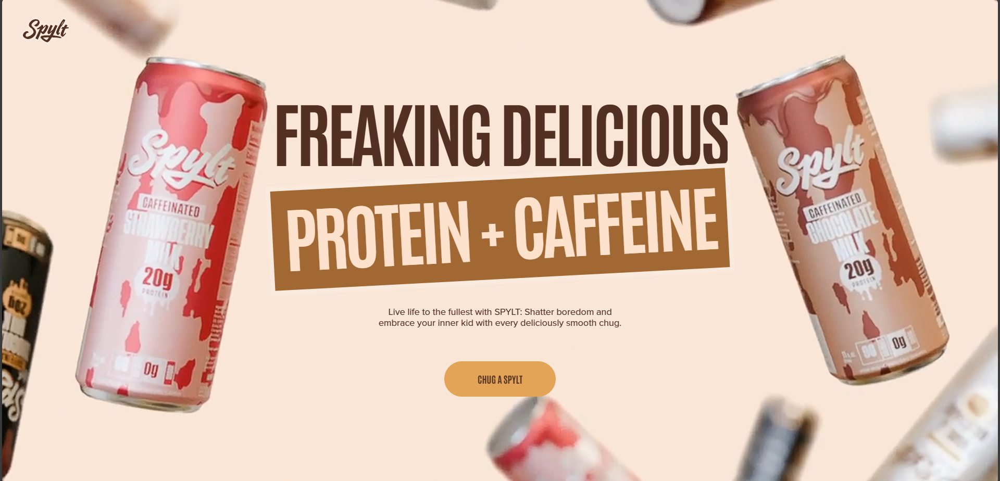
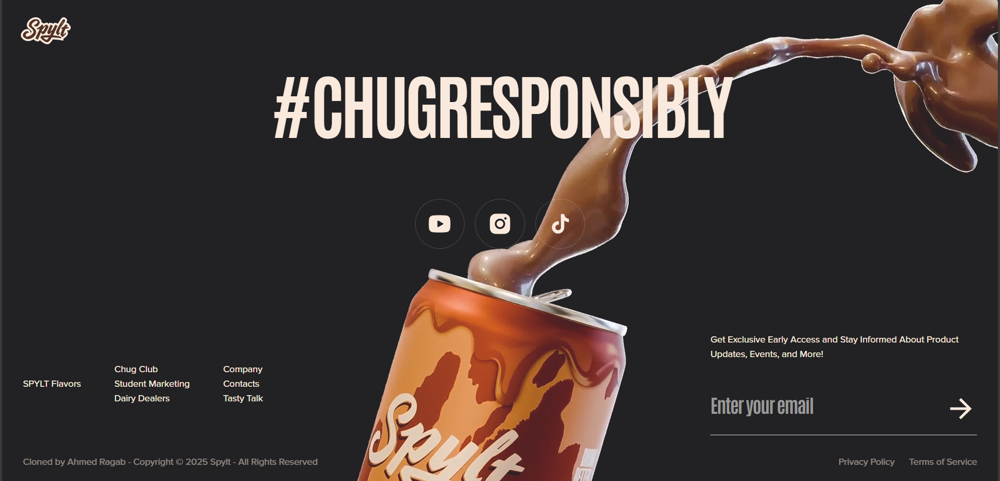

# 🎨 Spylt — GSAP Landing Page

A visually immersive and responsive landing page built with **Next.js**, **Tailwind CSS**, and **GSAP**. Inspired by award-winning web experiences, Spylt showcases scroll-triggered animations, parallax effects, clip-path transitions, and text reveals to deliver an engaging frontend animation showcase.

---

## 🛠️ Tech Stack

- **Framework:** Next.js (React)
- **Styling:** Tailwind CSS
- **Animations:** GSAP (ScrollTrigger, ScrollSmoother, timelines)
- **Responsive:** react-responsive

---

## ✨ Features

- 🎯 Scroll-triggered animations with GSAP’s `ScrollTrigger`
- 🪄 Parallax effects and pinning transitions
- 🔍 Advanced `clip-path` and reveal effects
- 🔁 Timeline-based animation orchestration
- ⚡ Smooth scrolling experience
- 📱 Fully responsive and mobile-friendly
- 🧠 Performance-focused layout

---

## 📸 Screenshots

   
  <br /> 

   
  <br /> 
 
   
  <br /> 
 
   

---


## 🚀 Live Demo

[🔗 View Live Demo](https://spylt-gsap-website.vercel.app)


---

## 📦 Getting Started

### 1. Clone the Repo

```bash
git clone https://github.com/ahmedragab15/spylt-gsap-website
cd spylt-gsap-website-main
```

### 2. Install Decencies then Start

```bash
npm install
npm run dev
```